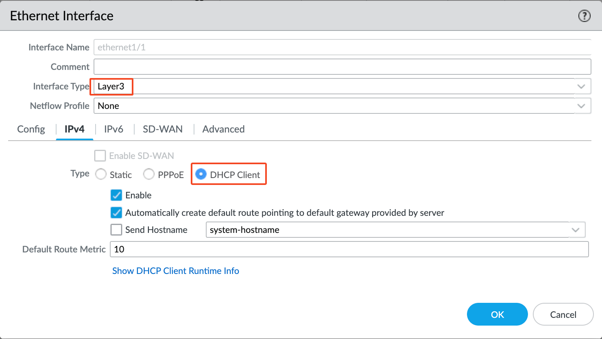

# terraform-aws-palo-bootstrap
- This module creates S3 bucket, load with pre-configured bootstrap configuration for Palo Alto Firewall in AWS.
- This module also create IAM role and policy, so that the FW instance can assume the role to retrieve bootstrap configuration from the S3 bucket.
- The exported bootstrap_bucket_name and iam_role can be used by Aviatrix resource: aviatrix_firewall_instance for bootstrap purpose.
- Pre-configured Palo configuration is stored under config/bootstrap.xml. eth1/2 is trusted network LAN, and eth1/1 is un-trusted network WAN.
    - Username: **admin**
    - Password: **yGNaoO3gzRtzwnzp**
- config/bootstrap.xml was exported from Palo VM series 11.0.2
- You may consider use config/init-cfg.txt for Panorama instead 
    - https://docs.paloaltonetworks.com/vm-series/11-0/vm-series-deployment/bootstrap-the-vm-series-firewall/create-the-init-cfgtxt-file/init-cfgtxt-file-components

## Pre-configured Palo configuration
- Assign eth1/2 as 'Layer3' interface type. Enable eth1/2 as 'DHCP client', and uncheck 'Automatically create default route pointing to default gateway provided by server'

- Assign eth1/2 to Virtual Router 'default'. Create new security zone 'LAN' and assign eth1/2 as LAN

- Assign eth1/1 as 'Layer3' interface type. Enable eth1/1 as 'DHCP client,

- Assign eth1/1 to Virtual Router 'default'. Create new security zone 'WAN' and assign eth1/1 as WAN

- Create policy to allow LAN to LAN any traffic

- Create policy to allow LAN to WAN any traffic

- Create policy for catch all rest of traffic and deny it

- This screenshot shows all policies and their order

- Create source NAT route for LAN -> WAN traffic to be SNAT to eth1/1 IP

- Create Interface Mgmt profile for ICMP ping health check coming from Aviatrix Transit Gateway

- Assign this health check Interface Mgmt profile with eth1/2


## providers.tf
You will need to populate providers.tf, example
```
terraform {
  required_providers {
    aws = {
      source = "hashicorp/aws"
    }
  }
}


# Configure the AWS Provider
provider "aws" {
  region = "us-east-1"
}
```

## Palo route table
Please use aviatrix_firenet_vendor_integration Data resource to manage Palo route table
https://registry.terraform.io/providers/AviatrixSystems/aviatrix/latest/docs/data-sources/aviatrix_firenet_vendor_integration

## Palo Security Group
Aviatrix Controller programs following entries for Palo Security Group.
By default it allows Controller Public IP access to Palo Management interface on following ports:
- icmp: Health check
- tcp 443: Management (You may need to add your egress public IP to access Palo Management Web interface)
- tcp 3978: Panorama access, please replace it with correct IP


## Sample usage
```
# Bootstrap S3 bucket and IAM Role
module "palo-bootstrap" {
  source  = "jye-aviatrix/palo-bootstrap/aws"
  version = "1.0.2"
  providers = {
    aws = aws.ue1
  }
}

## Region 1
# Firewall instance for region1 E/W FW
resource "aviatrix_firewall_instance" "region1_ew_fw_1" {
  firewall_name          = "${var.region1_code}-ew-fw-1"
  firewall_size          = "m5.xlarge"
  vpc_id                 = aviatrix_vpc.region1_ew_firenet.vpc_id
  firewall_image         = "Palo Alto Networks VM-Series Next-Generation Firewall (BYOL)"
  firewall_image_version = "11.0.2"
  egress_subnet          = element([for s in aviatrix_vpc.region1_ew_firenet.public_subnets : s["cidr"] if strcontains(s["name"], "Public-FW-ingress-egress")], 0)
  firenet_gw_name        = aviatrix_transit_gateway.region1_ew_transit_firenet.gw_name

  management_subnet = element([for s in aviatrix_vpc.region1_ew_firenet.public_subnets : s["cidr"] if strcontains(s["name"], "Public-gateway-and-firewall-mgmt")], 0)

  # Reference the iam_role and bootstrap_bucket_name output from this module
  iam_role = module.palo-bootstrap.iam_role
  bootstrap_bucket_name = module.palo-bootstrap.bootstrap_bucket_name
}
```

## Reference
https://docs.paloaltonetworks.com/vm-series/9-1/vm-series-deployment/bootstrap-the-vm-series-firewall/bootstrap-the-vm-series-firewall-in-aws


